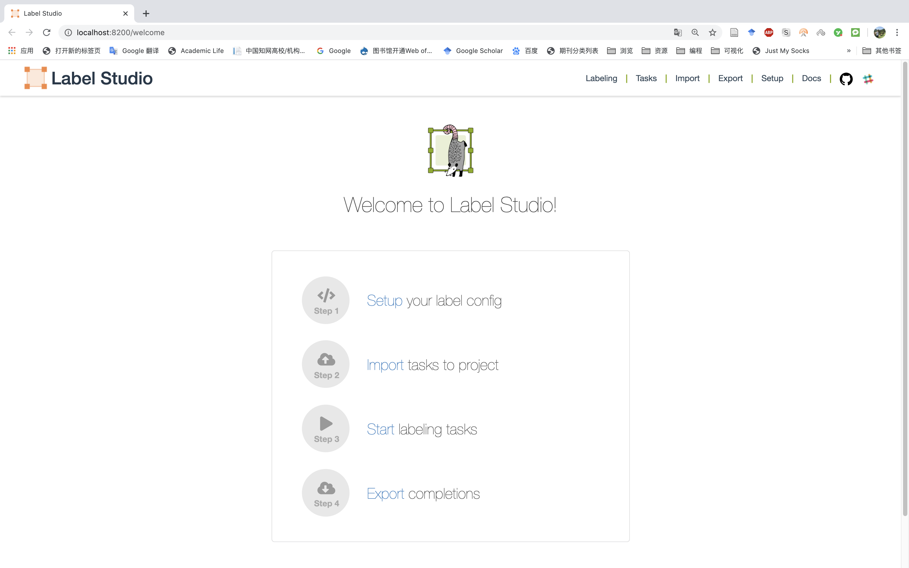
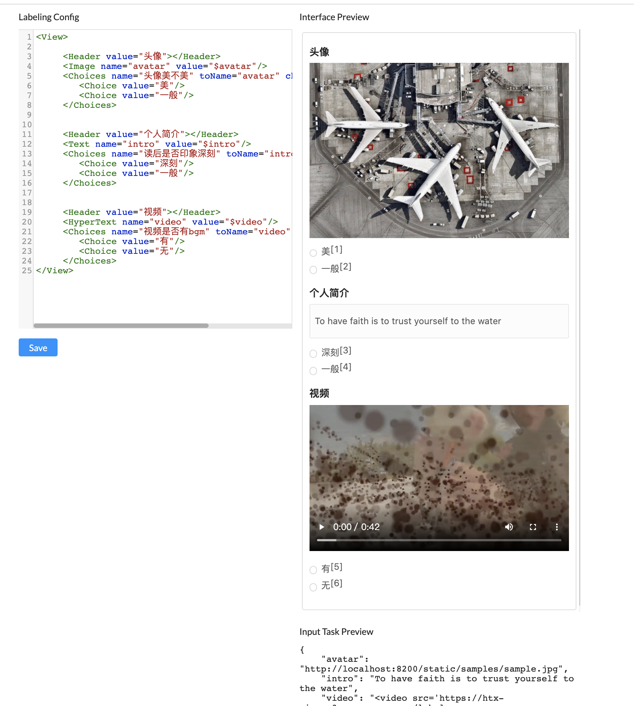
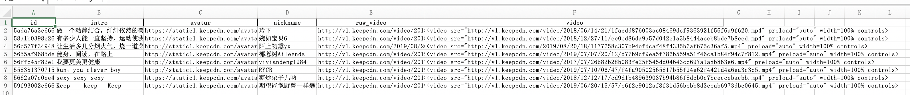
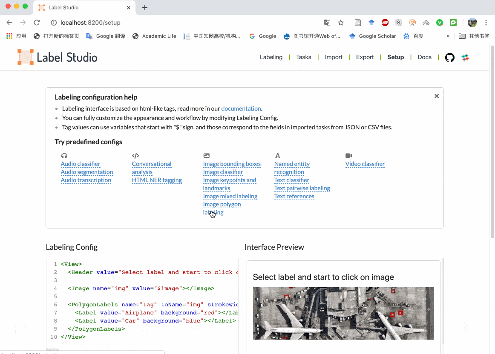
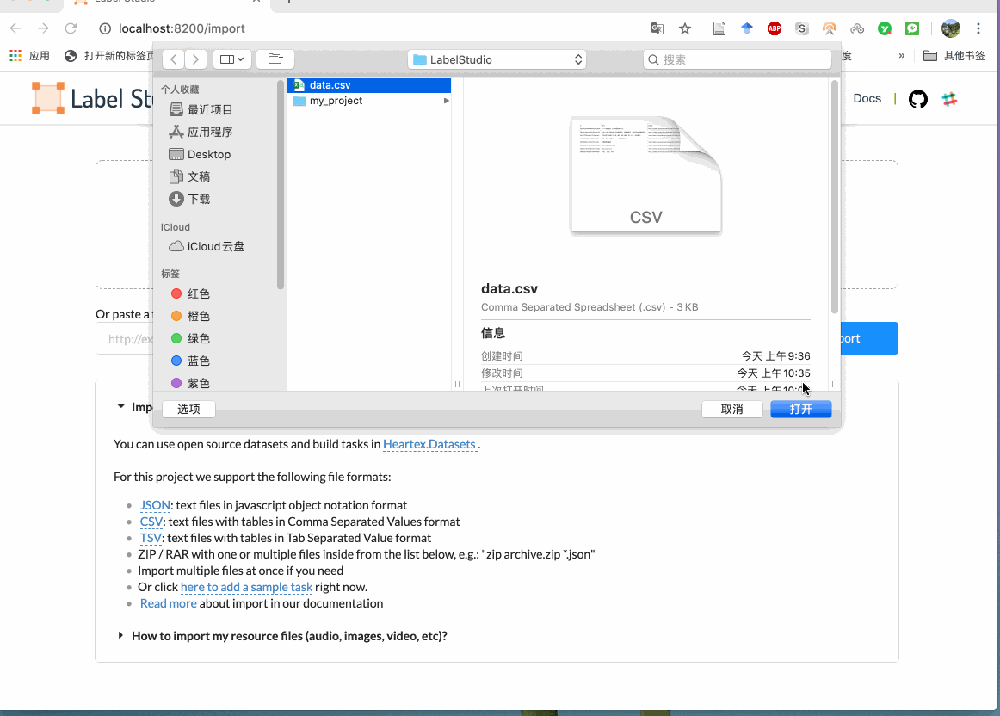
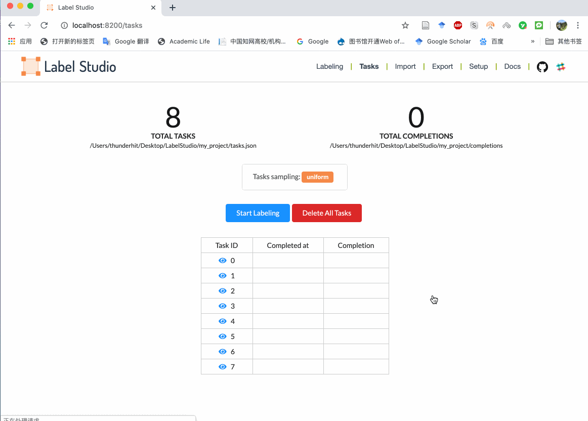
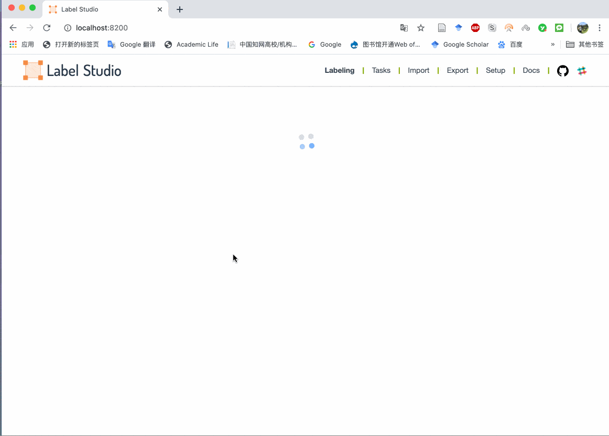
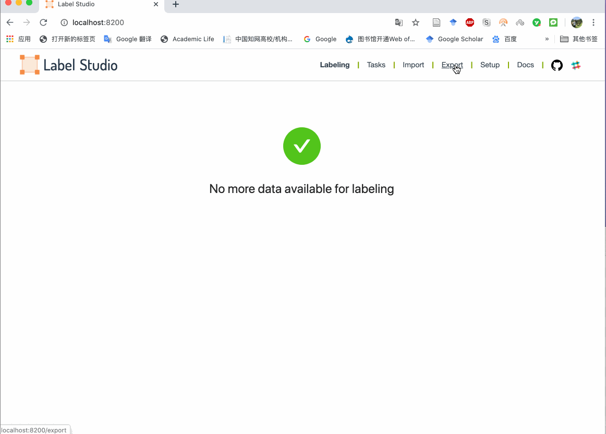
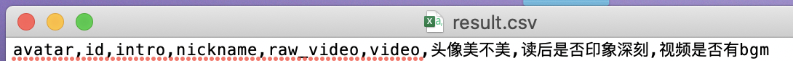

# Label Studio


## 一、简介

如果采集的数据有很多图片、音频视频链接，虽然Nvivo可以进行多媒体分析，但是需要事先下载好的多媒体文件导入到Nvivo才能进行。多媒体数据处理属于很hitech的部分，很难，大邓也不会(⊙o⊙)…。

所以对于小白或者文科生而言还是没法用python自动化快速实现多媒体数据的标注，但是却可以让我们的标注过程更高效。今天介绍的label-studio库可以在没下载相关多媒体情况下，仅仅依靠图片、音频、视频的链接即可联网打开，进行标注。

## [B站视频](https://www.bilibili.com/video/BV16C4y1s7XY/)

## 二、安装

```
pip install label-studio
```


## 三、 创建项目

1. 建议在**电脑桌面**新建一个文件夹**LabelStudio**(好的名字容易记住^_^)
2. 将路径切换至**LabelStudio文件夹**，需在**命令行**执行下面命令

```
cd desktop/LabelStudio
```

3. 创建一个名叫**my_project**的项目，命令行执行

```
label-studio start my_project --init
```




**打开项目**

如果已经创建了my_project，操作方法与创建项目类似，但要注意step3应该改为

```
label-studio start my_project
```


## 四、项目设置

根据自己需要标注的数据情况，我们需要设计标注页面。

### 4.1 标注默认项设置

默认的界面如下



图片中有左侧html解读

- 右侧Interface Preview是左侧html的渲染效果
- 右下角Input Task Preview默认测试数据预览
- $image是用来接收数据中的image字段
- 如果标注数据有视频，value一定要用"$video"，不然视频显示不了
- name与toName应该一样
- name不能重复

这块比较难理解，可看我的操作视频辅助你学习理解。该页面上方有很多不同任务类型对应的html设计，大家可以都点击蓝色链接查看一下。


#### 4.1.1 数据



假设我现在已有数据 **data.csv**，需要标注

- avatar
- intro
- video

我们平常采集到的视频链接是raw_video,但是labelstudio不能用链接直接渲染出视频，所以实际上我们用的是``video``。 ``video``中的src就是raw_video

```html
<video src="http://v1.keepcdn.com/video/2018/06/14/21/1facdd876003ac08469dcf9363921f56f6a9f620.mp4" preload="auto" width=100% controls>
```

**强调**

 带html样式的视频链接所在的列字段名一定要设置为video

#### 4.1.2 diy自己的html

现在我们根据data.csv的三个字段avatar、intro、video，设计了三个View块。

```html
<View>

      <Header value="头像"></Header>
      <Image name="avatar" value="$avatar"/>
      <Choices name="头像美不美" toName="avatar" choice="single-radio">
          <Choice value="美"/>
          <Choice value="一般"/>
      </Choices>

      <Header value="个人简介"></Header>
      <Text name="intro" value="$intro"/>
      <Choices name="读后是否印象深刻" toName="intro" choice="single-radio">
          <Choice value="深刻"/>
          <Choice value="一般"/>
      </Choices>


      <Header value="视频"></Header>
      <HyperText name="video" value="$video"/>
      <Choices name="视频是否有bgm" toName="video" choice="single-radio">
          <Choice value="有"/>
          <Choice value="无"/>
      </Choices>
    
</View>
```



渲染图如果没出错，符合你的语气，就点击左下角**Save**

### 4.2 导入数据

完成html设计后,这一步很简单，只需要上传需要标注的数据文件即可。



因为我们的数据只有8条，所以这里生成了8个标注任务。我们可以先试一试，点explore tasks，探索一下我们设置项目任务。



我们可以看到头像、简介、视频，并且对三个字段进行常识性标注。^_^


### 4.3 开始标注

前面不出错的话，这一步很简单，只需要标注几个数据，看看是否都能正常显示文本、图片和视频。



### 4.4 导出数据

假设经过很多努力，我们已经将标注任务完成，一定记得导出数据哦。

导出的数据格式，支持json、csv/tsv。



由于csv默认编码为utf-8, 所以用微软office打开会乱码，这里我用记事本打开，发现字段名多了   **头像美不美,读后是否印象深刻,视频是否有bgm**



**注意**

输出字段名与 **4.1.2 diy自己的html**对比，我们发现Choices中的name值决定输出字段，所以不要像我这样随便起名字。

```
 <Choices name="头像美不美" toName="avatar" choice="single-radio">
 <Choices name="读后是否印象深刻" toName="intro" choice="single-radio">
 <Choices name="视频是否有bgm" toName="video" choice="single-radio">
```

## 总结

label-studio在多媒体标注挺好用的，比较适合小数据量标注时候提高自己的标注效率。虽然NVivo也可以标注数据，但是都必须要先下载下来，而label-studio不需要下载，只需要保留多媒体链接即可。

其中要注意的是csv数据文件中的视频必须命名为video，且video字段都是html样式的数据。形如

```html
<video src="http://v1.keepcdn.com/video/2018/06/14/21/1facdd876003ac08469dcf9363921f56f6a9f620.mp4" preload="auto" width=100% controls>
```

